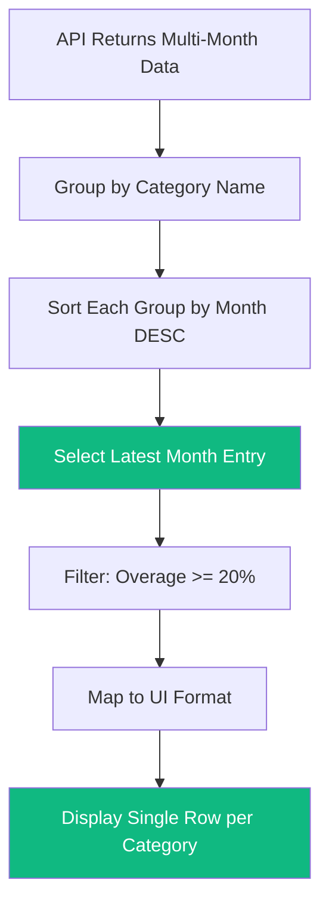

# Budget Variance Aggregation Fix - Architecture Plan

## Problem Summary

The [`Step3Recommendations.tsx`](../client-v2/src/components/smart-budget/Step3Recommendations.tsx:145) component incorrectly aggregates budget variances by summing values across multiple months for the same category, producing meaningless cumulative totals.

### The Bug Location

```typescript
// Lines 145-165 in Step3Recommendations.tsx - WRONG APPROACH
const groupedByCategory = new Map<string, { 
  budgetAmount: number; 
  actualAmount: number; 
  overagePercentage: number; 
  suggestedReduction: number; 
  name: string 
}>();

filtered.forEach(v => {
  const normalizedName = v.name.trim().toLowerCase();
  const existing = groupedByCategory.get(normalizedName);

  if (existing) {
    existing.budgetAmount += v.budgetAmount;        // WRONG: Sums 3 months = 15,000
    existing.actualAmount += v.actualAmount;        // WRONG: Sums 3 months = 18,000
    existing.overagePercentage = Math.max(...);     // Partially correct - takes max
    existing.suggestedReduction += v.suggestedReduction; // WRONG: Sums = 3,000
  }
  // ...
});
```

### Input Data Example

```typescript
budgetVariances: [
  { name: "Daycare", month: "2024-10", budgetAmount: 5000, actualAmount: 6000, overagePercentage: 20, suggestedReduction: 1000 },
  { name: "Daycare", month: "2024-11", budgetAmount: 5000, actualAmount: 5000, overagePercentage: 0, suggestedReduction: 0 },
  { name: "Daycare", month: "2024-12", budgetAmount: 5000, actualAmount: 7000, overagePercentage: 40, suggestedReduction: 2000 },
  { name: "Mortgage", month: "2024-12", budgetAmount: 10000, actualAmount: 10000, overagePercentage: 0, suggestedReduction: 0 }
]
```

### Current Wrong Output

| Metric | Value | Interpretation |
|--------|-------|----------------|
| Budget | 15,000 SEK | 3 months × 5,000 - meaningless |
| Actual | 18,000 SEK | 6k+5k+7k - meaningless |
| Overage | 40% | Max of 3 months |
| Suggested Reduction | 3,000 SEK | Sum of all reductions - meaningless |

---

## Analysis: What Should We Display?

### Option 1: Most Recent Month - RECOMMENDED

Show the latest available month for each category.

**Pros:**
- Most relevant to current budget planning
- Users think in monthly cycles
- Clear, actionable data
- Matches how the old [`BudgetOptimizationTips.js`](../client/src/components/BudgetOptimizationTips.js:915) handles it

**Cons:**
- May miss persistent overspending patterns if latest month is an outlier

**Output Example:**

| Category | Budget | Actual | Overage | Action |
|----------|--------|--------|---------|--------|
| Daycare | 5,000 | 7,000 | +40% | Reduce by 2,000 |

### Option 2: Worst Month - Highest Overage

Show the month with the highest overage percentage.

**Pros:**
- Highlights the biggest problem
- Conservative approach for budgeting

**Cons:**
- May show old data if the worst month was months ago
- Confusing if problem was already fixed

### Option 3: Calculate Averages

Average all values across months.

**Pros:**
- Smooths out outliers
- More stable recommendations

**Cons:**
- Overage percentages become meaningless if budget varies
- `suggestedReduction` doesn't average sensibly

### Option 4: Show Multiple Rows - Per Month

Show all months in the UI, grouped by category.

**Pros:**
- Complete transparency
- Users see the trend

**Cons:**
- UI clutter
- Harder to take action
- Contradicts the component's purpose - summarize and recommend

---

## Recommended Solution: Most Recent Month

Use **Option 1** because:

1. **User Mental Model**: Users budget monthly and expect to see current month data
2. **Actionable Insights**: The most recent month is what they need to fix NOW
3. **Existing Pattern**: The old [`getLatestVariance()`](../client/src/components/BudgetOptimizationTips.js:915) function already implements this correctly
4. **API Design**: The API returns `month` field specifically for this purpose

---

## Implementation Plan

### Step 1: Create Helper Function

Extract a reusable helper that selects the latest variance per category:

```typescript
// client-v2/src/lib/budgetAggregation.ts

import type { BudgetVariance } from '@/api/services/optimizationService';

export interface AggregatedVariance {
  name: string;
  month: string;
  budgetAmount: number;
  actualAmount: number;
  variance: number;
  overagePercentage: number;
  suggestedReduction: number;
  unusedAmount: number;
}

/**
 * Given an array of budget variances potentially containing the same category
 * across multiple months, returns only the most recent month for each category.
 */
export function getLatestVariancePerCategory(
  variances: BudgetVariance[]
): AggregatedVariance[] {
  if (!variances || variances.length === 0) {
    return [];
  }

  // Group by normalized category name
  const byCategory = new Map<string, BudgetVariance[]>();
  
  for (const v of variances) {
    const key = v.name.trim().toLowerCase();
    const existing = byCategory.get(key);
    if (existing) {
      existing.push(v);
    } else {
      byCategory.set(key, [v]);
    }
  }

  // For each category, select the most recent month
  const result: AggregatedVariance[] = [];
  
  for (const [, entries] of byCategory) {
    // Sort by month descending - latest first
    const sorted = [...entries].sort((a, b) => 
      b.month.localeCompare(a.month)
    );
    
    const latest = sorted[0];
    result.push({
      name: latest.name,
      month: latest.month,
      budgetAmount: latest.budgetAmount,
      actualAmount: latest.actualAmount,
      variance: latest.variance,
      overagePercentage: latest.overagePercentage,
      suggestedReduction: latest.suggestedReduction,
      unusedAmount: latest.unusedAmount
    });
  }

  return result;
}
```

### Step 2: Handle Edge Cases

```typescript
/**
 * Get latest variance with edge case handling
 */
export function getLatestVariancePerCategorySafe(
  variances: BudgetVariance[]
): AggregatedVariance[] {
  if (!variances || variances.length === 0) {
    return [];
  }

  const byCategory = new Map<string, BudgetVariance[]>();
  
  for (const v of variances) {
    // Edge case: Skip entries with no budget - cant calculate meaningful overage
    if (!v.budgetAmount || v.budgetAmount <= 0) {
      console.warn(`[budgetAggregation] Skipping ${v.name}: zero budget`);
      continue;
    }
    
    const key = v.name.trim().toLowerCase();
    const existing = byCategory.get(key);
    if (existing) {
      existing.push(v);
    } else {
      byCategory.set(key, [v]);
    }
  }

  const result: AggregatedVariance[] = [];
  
  for (const [, entries] of byCategory) {
    // Sort by month descending
    const sorted = [...entries].sort((a, b) => 
      b.month.localeCompare(a.month)
    );
    
    const latest = sorted[0];
    
    // Edge case: Recalculate overage percentage if it seems wrong
    let overagePercentage = latest.overagePercentage;
    if (latest.budgetAmount > 0) {
      const calculated = ((latest.actualAmount - latest.budgetAmount) / latest.budgetAmount) * 100;
      // Use calculated if API value seems off
      if (Math.abs(calculated - overagePercentage) > 5) {
        console.warn(`[budgetAggregation] ${latest.name}: API overage ${overagePercentage}% differs from calculated ${calculated.toFixed(1)}%`);
        overagePercentage = Math.round(calculated);
      }
    }
    
    // Edge case: Ensure suggestedReduction doesnt exceed budget
    const suggestedReduction = Math.min(
      latest.suggestedReduction,
      latest.budgetAmount
    );
    
    result.push({
      name: latest.name,
      month: latest.month,
      budgetAmount: latest.budgetAmount,
      actualAmount: latest.actualAmount,
      variance: latest.variance,
      overagePercentage: Math.max(0, overagePercentage), // No negative overage
      suggestedReduction: Math.max(0, suggestedReduction),
      unusedAmount: Math.max(0, latest.unusedAmount)
    });
  }

  return result;
}
```

### Step 3: Update Step3Recommendations Component

Replace the aggregation logic in [`getOverspendingCategories()`](../client-v2/src/components/smart-budget/Step3Recommendations.tsx:130):

```typescript
// client-v2/src/components/smart-budget/Step3Recommendations.tsx

import { getLatestVariancePerCategorySafe } from '@/lib/budgetAggregation';

const getOverspendingCategories = (): BudgetVariance[] => {
  if (mockOverspending) return mockOverspending;
  if (!optimizationData?.budgetVariances) {
    console.log('[Step3] No budget variances in optimization data');
    return [];
  }

  // NEW: Use latest variance per category instead of summing
  const latestVariances = getLatestVariancePerCategorySafe(
    optimizationData.budgetVariances
  );

  // Filter for overspending - 20% threshold
  const overspending = latestVariances.filter(v => {
    const matches = v.overagePercentage >= 20 && v.budgetAmount > 0 && v.actualAmount > 0;
    if (!matches) {
      console.log(`[Step3] Skipping ${v.name}: overage=${v.overagePercentage}%, budget=${v.budgetAmount}, actual=${v.actualAmount}`);
    }
    return matches;
  });

  // Map to UI format
  return overspending.map(v => {
    const category = categories.find(c => 
      c.name.trim().toLowerCase() === v.name.trim().toLowerCase()
    );

    if (!category) {
      console.warn(`[Step3] Category not found: "${v.name}"`);
    }

    const suggestedAmount = Math.max(0, v.budgetAmount - v.suggestedReduction);

    return {
      categoryId: category?.id || 0,
      categoryName: v.name,
      overagePercentage: v.overagePercentage,
      suggestedReduction: v.suggestedReduction,
      suggestedAmount,
      confidenceScore: 85,
      categoryColor: category?.color || 'amber'
    };
  });
};
```

### Step 4: Apply Same Fix to Underutilized Categories

```typescript
const getUnderutilizedCategories = (): UnderutilizedBudget[] => {
  if (mockUnderutilized) return mockUnderutilized;
  if (!optimizationData?.budgetVariances) {
    return [];
  }

  // NEW: Use latest per category
  const latestVariances = getLatestVariancePerCategorySafe(
    optimizationData.budgetVariances
  );

  // Filter for underutilized - has unused amount
  const underutilized = latestVariances.filter(v => 
    v.unusedAmount > 0 && v.budgetAmount > 0
  );

  return underutilized.map(v => {
    const usagePercentage = ((v.budgetAmount - v.unusedAmount) / v.budgetAmount) * 100;
    const category = categories.find(c => 
      c.name.trim().toLowerCase() === v.name.trim().toLowerCase()
    );

    return {
      categoryId: category?.id || 0,
      categoryName: v.name,
      unusedAmount: v.unusedAmount,
      usagePercentage: Math.round(usagePercentage),
      categoryColor: category?.color || 'teal'
    };
  });
};
```

---

## Alternative: Enhanced Solution with Trend Context

If you want to provide more context, you could enhance the display to show the month being referenced:

```typescript
interface EnhancedBudgetVariance extends BudgetVariance {
  monthLabel: string;        // "December 2024"
  monthsAnalyzed: number;    // 3 - how many months of data
  historicalTrend: 'improving' | 'worsening' | 'stable';
}

function formatMonthLabel(month: string): string {
  const [year, monthNum] = month.split('-');
  const date = new Date(Number(year), Number(monthNum) - 1, 1);
  return date.toLocaleDateString('en', { month: 'long', year: 'numeric' });
}
```

Then in the UI:

```tsx
<span className="text-xs text-slate-500">
  Based on {formatMonthLabel(variance.month)} data
</span>
```

---

## Edge Cases Handled

| Edge Case | How It's Handled |
|-----------|------------------|
| Zero budget | Skipped with warning log |
| Negative variance - under budget | Filtered out since overagePercentage < 20 |
| Categories with varying budgets across months | Uses latest month's budget value |
| Missing month data | Uses whatever months are available |
| Zero actual spending | Filtered out by actualAmount > 0 check |
| API returns incorrect overage percentage | Recalculated from budgetAmount/actualAmount |

---

## Testing Checklist

1. Single month data - should work unchanged
2. Multiple months same category - should show latest only
3. Mixed categories with different month counts
4. Edge case: category only in old months
5. Edge case: zero budget categories
6. Edge case: negative variance - under budget

---

## API Recommendation

The current API design is fine. It returns granular per-month data which allows the frontend to:

- Show monthly trends
- Show latest data
- Calculate averages if needed

No API changes required. The fix is purely frontend aggregation logic.

---

## Files to Modify

1. **New File**: `client-v2/src/lib/budgetAggregation.ts` - Helper functions
2. **Modify**: `client-v2/src/components/smart-budget/Step3Recommendations.tsx` - Use new helpers
3. **New Tests**: `client-v2/src/lib/__tests__/budgetAggregation.test.ts` - Unit tests

---

## Summary

The fix is straightforward: replace the summing aggregation with a **select-latest-per-category** approach. This matches user expectations, provides actionable data, and aligns with how the legacy component handled this.


