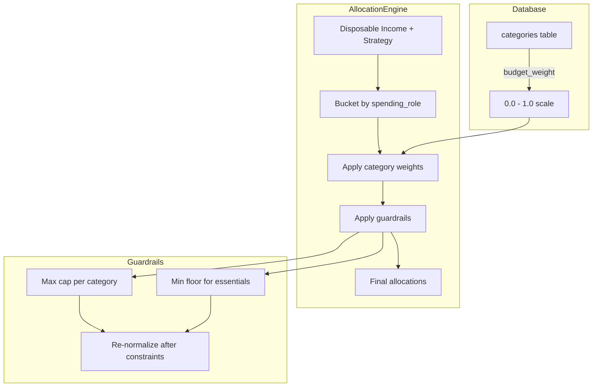

# Smart Budget Weighted Allocation System

## Problem Statement

The current budget allocation logic in [`Step2Architect.tsx`](../client-v2/src/components/smart-budget/Step2Architect.tsx:96) distributes budgets **equally** within each spending role bucket (need/want/save). This results in nonsensical distributions where low-priority categories like "Subscriptions and Apps" receive the same percentage as essential categories like "Groceries".

**Example of Current Behavior:**
- Income: kr 50,000
- After fixed expenses: kr 35,000 disposable
- "Wants" budget (30%): kr 15,000
- 4 "want" categories → each gets kr 3,750 regardless of type

This treats "Dining Out" the same as "Streaming Subscriptions", which violates reasonable household budgeting expectations.

## Proposed Solution

Implement a **database-driven weighted allocation system** with configurable priority weights and sensible guardrails.

### Key Components

1. **Category Weight Field**: Add `budget_weight` column to categories
2. **Weighted Distribution Algorithm**: Replace equal distribution with weight-based proportional allocation
3. **Guardrails System**: Caps and floors to prevent extreme allocations
4. **UI for Weight Management**: Allow users to customize weights in Settings

---

## Architecture Overview



---

## Detailed Implementation Plan

### Phase 1: Database Schema Changes

#### 1.1 Create Migration for budget_weight Column

**File:** `server/db/migrations/YYYYMMDD_add_budget_weight_to_categories.js`

```javascript
exports.up = function(knex) {
  return knex.schema.alterTable('categories', (table) => {
    // Weight from 0.0 to 1.0, default 0.5 (medium priority)
    table.decimal('budget_weight', 3, 2).defaultTo(0.50);
    // Optional: min/max percentage constraints
    table.decimal('budget_min_pct', 5, 2).nullable(); // e.g., 0.10 = 10% floor
    table.decimal('budget_max_pct', 5, 2).nullable(); // e.g., 0.25 = 25% cap
  });
};

exports.down = function(knex) {
  return knex.schema.alterTable('categories', (table) => {
    table.dropColumn('budget_weight');
    table.dropColumn('budget_min_pct');
    table.dropColumn('budget_max_pct');
  });
};
```

#### 1.2 Update Seeded Categories with Default Weights

**Rationale for Weight Assignments:**

| Category | spending_role | Weight | Min % | Max % | Reasoning |
|----------|---------------|--------|-------|-------|-----------|
| Groceries | need | 0.80 | 0.15 | null | Essential, high priority |
| Mortgage | need | 0.90 | null | null | Fixed, top priority |
| Utilities | need | 0.70 | 0.05 | null | Essential infrastructure |
| Transportation | need | 0.60 | 0.05 | null | Essential for work |
| Healthcare | need | 0.75 | 0.03 | null | Health is priority |
| Dining Out | want | 0.50 | null | 0.15 | Lifestyle, moderate |
| Entertainment | want | 0.40 | null | 0.12 | Discretionary |
| Kids Clothes | want | 0.55 | null | 0.15 | Important for families |
| Household Items | want | 0.45 | null | 0.10 | Moderate priority |
| Subscriptions | want | 0.20 | null | 0.05 | Low priority, easy to cut |
| Savings | save | 0.90 | 0.10 | null | Priority savings |
| Miscellaneous | want | 0.30 | null | 0.08 | Catch-all, low priority |

---

### Phase 2: Type and API Updates

#### 2.1 Extend Category Type

**File:** [`client-v2/src/types/index.ts`](../client-v2/src/types/index.ts:58)

```typescript
export interface Category {
  id: number;
  name: string;
  icon?: string;
  color?: string;
  is_fixed?: boolean;
  spending_role?: 'need' | 'want' | 'save';
  // New fields for weighted allocation
  budget_weight?: number;      // 0.0 - 1.0, default 0.5
  budget_min_pct?: number;     // Optional minimum % of bucket
  budget_max_pct?: number;     // Optional maximum % of bucket
}
```

#### 2.2 Update Category API Routes

**File:** `server/routes/categories.js`

Ensure the PUT and POST endpoints handle the new fields.

---

### Phase 3: Weighted Allocation Utility

#### 3.1 Create Allocation Engine

**File:** `client-v2/src/lib/budgetAllocation.ts`

```typescript
import { Category } from '../types';

export interface AllocationConfig {
  categories: Category[];
  totalBudget: number;
  strategy?: 'balanced' | 'saver' | 'spender';
}

export interface AllocationResult {
  categoryId: number;
  categoryName: string;
  allocatedAmount: number;
  percentOfBucket: number;
  constraintApplied?: 'min' | 'max' | null;
}

/**
 * Calculate weighted allocations for categories within a spending role bucket.
 * 
 * Algorithm:
 * 1. Sum all category weights in the bucket
 * 2. Calculate proportional share for each category
 * 3. Apply min/max guardrails
 * 4. Re-normalize remaining budget for unconstrained categories
 */
export function calculateWeightedAllocations(
  categories: Category[],
  bucketBudget: number
): AllocationResult[] {
  if (categories.length === 0 || bucketBudget <= 0) {
    return [];
  }

  // Step 1: Calculate total weight
  const totalWeight = categories.reduce(
    (sum, cat) => sum + (cat.budget_weight ?? 0.5),
    0
  );

  // Step 2: Initial proportional allocation
  let allocations = categories.map(cat => {
    const weight = cat.budget_weight ?? 0.5;
    const share = totalWeight > 0 ? weight / totalWeight : 1 / categories.length;
    return {
      categoryId: cat.id,
      categoryName: cat.name,
      weight,
      minPct: cat.budget_min_pct,
      maxPct: cat.budget_max_pct,
      rawShare: share,
      allocatedAmount: Math.round(bucketBudget * share),
      percentOfBucket: share * 100,
      constraintApplied: null as 'min' | 'max' | null,
    };
  });

  // Step 3: Apply guardrails with redistribution
  let iterations = 0;
  const maxIterations = 5; // Prevent infinite loops
  let needsRebalance = true;

  while (needsRebalance && iterations < maxIterations) {
    needsRebalance = false;
    iterations++;

    let lockedBudget = 0;
    let unlockedWeight = 0;
    const lockedCategories = new Set<number>();

    // Check min constraints
    for (const alloc of allocations) {
      if (alloc.minPct !== undefined && alloc.minPct !== null) {
        const minAmount = bucketBudget * alloc.minPct;
        if (alloc.allocatedAmount < minAmount) {
          alloc.allocatedAmount = Math.round(minAmount);
          alloc.constraintApplied = 'min';
          lockedCategories.add(alloc.categoryId);
          needsRebalance = true;
        }
      }
    }

    // Check max constraints
    for (const alloc of allocations) {
      if (alloc.maxPct !== undefined && alloc.maxPct !== null) {
        const maxAmount = bucketBudget * alloc.maxPct;
        if (alloc.allocatedAmount > maxAmount) {
          alloc.allocatedAmount = Math.round(maxAmount);
          alloc.constraintApplied = 'max';
          lockedCategories.add(alloc.categoryId);
          needsRebalance = true;
        }
      }
    }

    // Redistribute if needed
    if (needsRebalance) {
      // Calculate locked vs unlocked budget
      for (const alloc of allocations) {
        if (lockedCategories.has(alloc.categoryId)) {
          lockedBudget += alloc.allocatedAmount;
        } else {
          unlockedWeight += alloc.weight;
        }
      }

      const remainingBudget = bucketBudget - lockedBudget;

      // Redistribute to unlocked categories
      for (const alloc of allocations) {
        if (!lockedCategories.has(alloc.categoryId)) {
          const share = unlockedWeight > 0 
            ? alloc.weight / unlockedWeight 
            : 1 / (allocations.length - lockedCategories.size);
          alloc.allocatedAmount = Math.round(remainingBudget * share);
          alloc.percentOfBucket = (alloc.allocatedAmount / bucketBudget) * 100;
        }
      }
    }
  }

  // Update final percentages
  return allocations.map(a => ({
    categoryId: a.categoryId,
    categoryName: a.categoryName,
    allocatedAmount: a.allocatedAmount,
    percentOfBucket: (a.allocatedAmount / bucketBudget) * 100,
    constraintApplied: a.constraintApplied,
  }));
}

/**
 * Fallback weights for common category names when database weight is missing.
 * Used for graceful degradation and new category suggestions.
 */
export const DEFAULT_CATEGORY_WEIGHTS: Record<string, number> = {
  // Needs - High Priority
  'groceries': 0.80,
  'mortgage': 0.90,
  'rent': 0.90,
  'utilities': 0.70,
  'transportation': 0.60,
  'healthcare': 0.75,
  'insurance': 0.70,
  'internet': 0.60,
  'phone': 0.55,
  
  // Wants - Variable Priority
  'dining out': 0.50,
  'dining': 0.50,
  'restaurants': 0.50,
  'entertainment': 0.40,
  'kids clothes': 0.55,
  'clothing': 0.45,
  'household items': 0.45,
  'household': 0.45,
  'shopping': 0.40,
  'subscriptions': 0.20,
  'streaming': 0.15,
  'apps': 0.15,
  'hobbies': 0.35,
  'gifts': 0.30,
  'miscellaneous': 0.30,
  'other': 0.25,
  
  // Savings - High Priority
  'savings': 0.90,
  'emergency fund': 0.95,
  'investments': 0.85,
  'retirement': 0.90,
};

/**
 * Get weight for a category, using database value or falling back to defaults.
 */
export function getCategoryWeight(category: Category): number {
  if (category.budget_weight !== undefined && category.budget_weight !== null) {
    return category.budget_weight;
  }
  
  const nameKey = category.name.toLowerCase();
  for (const [pattern, weight] of Object.entries(DEFAULT_CATEGORY_WEIGHTS)) {
    if (nameKey.includes(pattern)) {
      return weight;
    }
  }
  
  // Default fallback based on spending_role
  switch (category.spending_role) {
    case 'need': return 0.60;
    case 'save': return 0.80;
    case 'want': 
    default: return 0.40;
  }
}
```

---

### Phase 4: Update Step2Architect Component

#### 4.1 Integrate Weighted Allocation

**File:** [`client-v2/src/components/smart-budget/Step2Architect.tsx`](../client-v2/src/components/smart-budget/Step2Architect.tsx:96)

Replace the current equal distribution logic in the `useEffect` (lines 99-174) with the weighted allocation engine:

```typescript
import { calculateWeightedAllocations, getCategoryWeight } from '@/lib/budgetAllocation';

// Inside the useEffect that handles auto-allocation...
useEffect(() => {
    if (hasUserEditedVariables || disposableIncome <= 0) {
        return;
    }

    // Prepare categories with weights
    const variableNeedCats = variableCats
      .filter((c) => getCategoryRole(c) === 'need')
      .map(c => ({ ...c, budget_weight: getCategoryWeight(c) }));
    const variableWantCats = variableCats
      .filter((c) => getCategoryRole(c) === 'want')
      .map(c => ({ ...c, budget_weight: getCategoryWeight(c) }));
    const variableSaveCats = variableCats
      .filter((c) => getCategoryRole(c) === 'save')
      .map(c => ({ ...c, budget_weight: getCategoryWeight(c) }));

    // Calculate bucket budgets (same as before)
    const fixedNeeds = fixedCats
      .filter((c) => getCategoryRole(c) === 'need')
      .reduce((sum, c) => sum + (localFixed[c.id] || 0), 0);

    let variableNeedsBudget = Math.max(0, needsTargetAmount - fixedNeeds);
    let wantsBudget = state.income * strategy.distribution.wants;
    let savingsBudget = state.income * strategy.distribution.savings;

    // Scale if over disposable
    const plannedTotal = variableNeedsBudget + wantsBudget + savingsBudget;
    if (plannedTotal > disposableIncome && plannedTotal > 0) {
      const scale = disposableIncome / plannedTotal;
      variableNeedsBudget *= scale;
      wantsBudget *= scale;
      savingsBudget *= scale;
    }

    const newAllocations: Record<number, number> = {};

    // Use weighted allocation for each bucket
    const needAllocations = calculateWeightedAllocations(variableNeedCats, variableNeedsBudget);
    needAllocations.forEach(a => { newAllocations[a.categoryId] = a.allocatedAmount; });

    const wantAllocations = calculateWeightedAllocations(variableWantCats, wantsBudget);
    wantAllocations.forEach(a => { newAllocations[a.categoryId] = a.allocatedAmount; });

    const saveAllocations = calculateWeightedAllocations(variableSaveCats, savingsBudget);
    saveAllocations.forEach(a => { newAllocations[a.categoryId] = a.allocatedAmount; });

    setLocalVariable(newAllocations);
    Object.entries(newAllocations).forEach(([id, val]) => {
      updateVariable(parseInt(id, 10), val as number);
    });
}, [/* dependencies */]);
```

---

### Phase 5: UI for Weight Management

#### 5.1 Add Weight Slider to Category Settings

**Location:** Category edit modal in Settings page

```typescript
// In category form component
<div className="space-y-2">
  <Label htmlFor="budget-weight">Budget Priority Weight</Label>
  <div className="flex items-center gap-4">
    <Slider
      id="budget-weight"
      min={0}
      max={100}
      step={5}
      value={[budgetWeight * 100]}
      onValueChange={([val]) => setBudgetWeight(val / 100)}
      className="flex-1"
    />
    <span className="text-sm text-muted-foreground w-12">
      {Math.round(budgetWeight * 100)}%
    </span>
  </div>
  <p className="text-xs text-muted-foreground">
    Higher weight = larger share of budget bucket
  </p>
</div>
```

---

### Phase 6: Testing Strategy

#### 6.1 Unit Tests for Allocation Engine

**File:** `client-v2/src/lib/__tests__/budgetAllocation.test.ts`

```typescript
describe('calculateWeightedAllocations', () => {
  it('distributes budget proportionally to weights', () => {
    const categories = [
      { id: 1, name: 'Groceries', budget_weight: 0.8 },
      { id: 2, name: 'Subscriptions', budget_weight: 0.2 },
    ];
    const result = calculateWeightedAllocations(categories, 10000);
    
    expect(result[0].allocatedAmount).toBe(8000); // 80%
    expect(result[1].allocatedAmount).toBe(2000); // 20%
  });

  it('enforces minimum floor constraints', () => {
    const categories = [
      { id: 1, name: 'Groceries', budget_weight: 0.3, budget_min_pct: 0.40 },
      { id: 2, name: 'Other', budget_weight: 0.7 },
    ];
    const result = calculateWeightedAllocations(categories, 10000);
    
    expect(result[0].allocatedAmount).toBeGreaterThanOrEqual(4000);
    expect(result[0].constraintApplied).toBe('min');
  });

  it('enforces maximum cap constraints', () => {
    const categories = [
      { id: 1, name: 'Entertainment', budget_weight: 0.9, budget_max_pct: 0.15 },
      { id: 2, name: 'Other', budget_weight: 0.1 },
    ];
    const result = calculateWeightedAllocations(categories, 10000);
    
    expect(result[0].allocatedAmount).toBeLessThanOrEqual(1500);
    expect(result[0].constraintApplied).toBe('max');
  });

  it('handles empty category list gracefully', () => {
    const result = calculateWeightedAllocations([], 10000);
    expect(result).toEqual([]);
  });

  it('handles zero budget gracefully', () => {
    const categories = [{ id: 1, name: 'Test', budget_weight: 0.5 }];
    const result = calculateWeightedAllocations(categories, 0);
    expect(result).toEqual([]);
  });
});
```

---

## Migration Safety

1. **Backward Compatibility**: New columns have defaults, so existing categories work without updates
2. **Graceful Fallback**: `getCategoryWeight()` uses name-based heuristics if database weight is null
3. **Non-Breaking**: UI changes are additive; existing wizard flow unchanged for users

---

## Example Allocation Comparison

**Scenario:** kr 15,000 wants budget, 4 categories

| Category | Old System | New System (Weighted) |
|----------|------------|----------------------|
| Dining Out (0.50) | kr 3,750 | kr 4,688 |
| Entertainment (0.40) | kr 3,750 | kr 3,750 |
| Household (0.45) | kr 3,750 | kr 4,219 |
| Subscriptions (0.20) | kr 3,750 | kr 1,875 |
| Streaming (max 5%) | kr 3,750 | kr 750 (capped) |

The new system correctly reduces low-priority discretionary spending while maintaining reasonable allocations for higher-priority lifestyle categories.

---

## Files to Modify

| File | Change Type |
|------|-------------|
| `server/db/migrations/YYYYMMDD_add_budget_weight.js` | New file |
| `server/routes/categories.js` | Update POST/PUT handlers |
| `client-v2/src/types/index.ts` | Add Category fields |
| `client-v2/src/lib/budgetAllocation.ts` | New file |
| `client-v2/src/components/smart-budget/Step2Architect.tsx` | Integrate weighted allocation |
| `client-v2/src/lib/__tests__/budgetAllocation.test.ts` | New test file |
| Category management UI (if editing weights) | Add weight slider |
